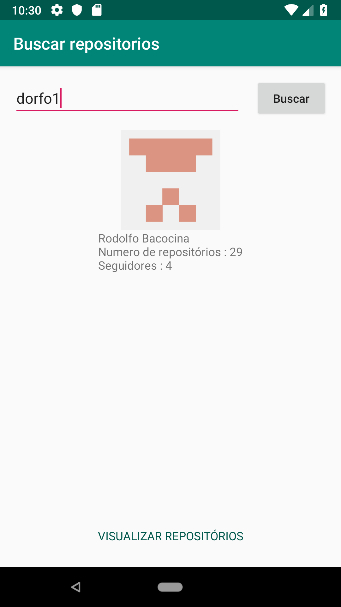
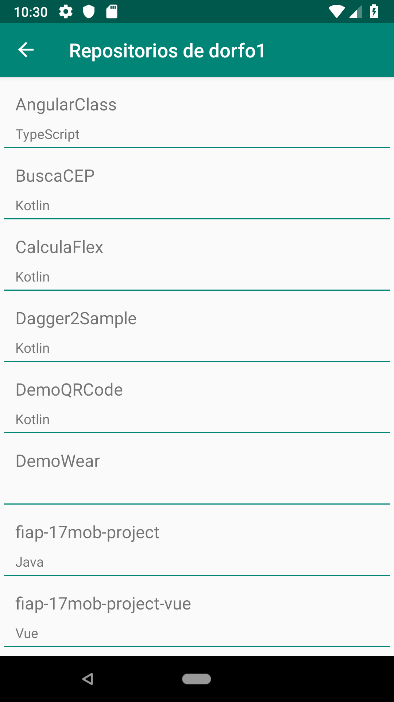

# GitMVVM

Projeto simples utilizando a arquitetura MVVM.

* Consumo da API do GitHub utilizando retrofit e coroutines
* Uso do [Navigation](https://developer.android.com/guide/navigation) para a navegação
* Uso do Room para Salvar dados do usuário localmente
* RecyclerView
* DataBinding
* KTX
* [Glide](https://github.com/bumptech/glide) para carregar imagens
* Stheto para debug nas chamadas da API

 
